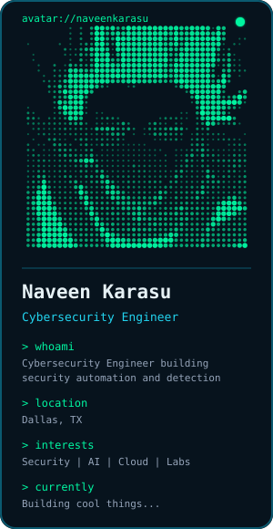
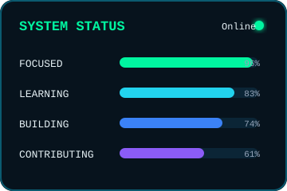
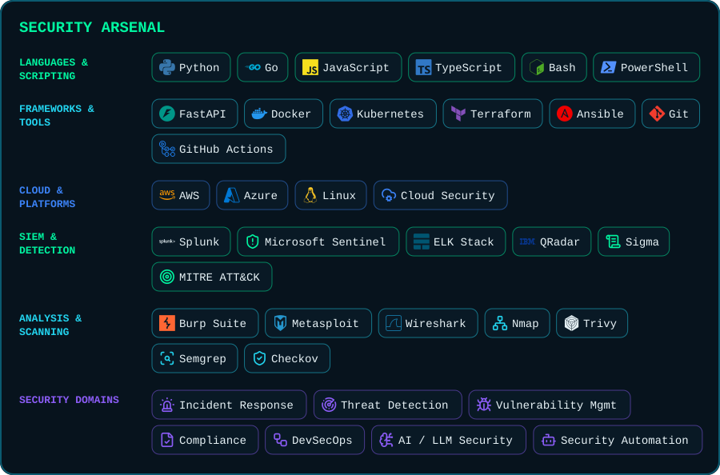
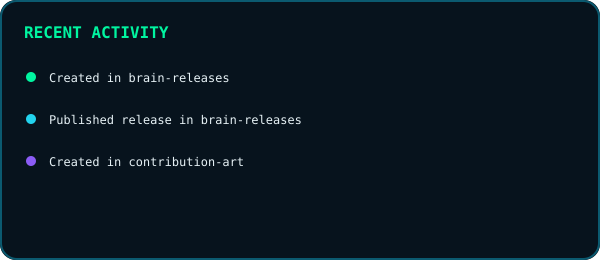
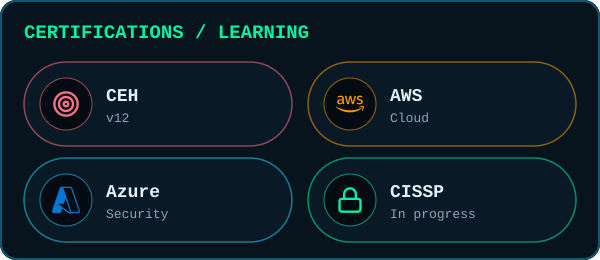

<!--
  NAVEEN KARASU — cyber system UI profile README
  Visual language: anime night-city + terminal + pixel + capsule/aura + night-green contributions.
  GitHub does not allow arbitrary page CSS/JavaScript in a profile README, so the layout is
  composed from repository-local SVG assets and HTML tables. Links must be absolute URLs:
  GitHub rewrites relative links to paths inside this repository.
-->

  

<table width="100%">
<tr>
<td width="30%" valign="top" rowspan="2">
  <picture>
    <source media="(prefers-color-scheme: dark)" srcset="./assets/ascii-profile.svg" />
    <source media="(prefers-color-scheme: light)" srcset="./assets/ascii-profile-light.svg" />
    
  </picture>
</td>
<td width="44%" valign="top">
  <picture>
    <source media="(prefers-color-scheme: dark)" srcset="./assets/intro.svg" />
    <source media="(prefers-color-scheme: light)" srcset="./assets/intro-light.svg" />
    
  </picture>
</td>
<td width="26%" valign="top">
  <picture>
    <source media="(prefers-color-scheme: dark)" srcset="./assets/system-status.svg" />
    <source media="(prefers-color-scheme: light)" srcset="./assets/system-status-light.svg" />
    
  </picture>
</td>
</tr>
<tr>
<td colspan="2" valign="top">
  <picture>
    <source media="(prefers-color-scheme: dark)" srcset="./assets/skills.svg" />
    <source media="(prefers-color-scheme: light)" srcset="./assets/skills-light.svg" />
    
  </picture>
</td>
</tr>
</table>

<table width="100%">
<tr>
<td width="33.33%" valign="top">
  <a href="https://github.com/naveenkarasu/AI-log-investigator">
    <picture>
      <source media="(prefers-color-scheme: dark)" srcset="./assets/projects/ai-log-investigator.svg" />
      <source media="(prefers-color-scheme: light)" srcset="./assets/projects/ai-log-investigator-light.svg" />
      
    </picture>
  </a>
</td>
<td width="33.33%" valign="top">
  <a href="https://github.com/naveenkarasu/CEHV12_StudyGuide">
    <picture>
      <source media="(prefers-color-scheme: dark)" srcset="./assets/projects/cehv12-study-guide.svg" />
      <source media="(prefers-color-scheme: light)" srcset="./assets/projects/cehv12-study-guide-light.svg" />
      
    </picture>
  </a>
</td>
<td width="33.33%" valign="top">
  <a href="https://github.com/naveenkarasu/portfolio-3d">
    <picture>
      <source media="(prefers-color-scheme: dark)" srcset="./assets/projects/portfolio-3d.svg" />
      <source media="(prefers-color-scheme: light)" srcset="./assets/projects/portfolio-3d-light.svg" />
      
    </picture>
  </a>
</td>
</tr>
</table>

  <picture>
    <source media="(prefers-color-scheme: dark)" srcset="./assets/contributions.svg" />
    <source media="(prefers-color-scheme: light)" srcset="./assets/contributions-light.svg" />
    
  </picture>

<table width="100%">
<tr>
<td width="91%" valign="middle">
  <picture>
    <source media="(prefers-color-scheme: dark)" srcset="./assets/contribution-snake-dark.svg" />
    <source media="(prefers-color-scheme: light)" srcset="./assets/contribution-snake-light.svg" />
    
  </picture>
</td>
<td width="9%" valign="middle">
  <picture>
    <source media="(prefers-color-scheme: dark)" srcset="./assets/pixel-cat.svg" />
    <source media="(prefers-color-scheme: light)" srcset="./assets/pixel-cat-light.svg" />
    
  </picture>
</td>
</tr>
</table>

  <picture>
    <source media="(prefers-color-scheme: dark)" srcset="./assets/stats.svg" />
    <source media="(prefers-color-scheme: light)" srcset="./assets/stats-light.svg" />
    
  </picture>

<table width="100%">
<tr>
<td width="50%" valign="top">
  <picture>
    <source media="(prefers-color-scheme: dark)" srcset="./assets/activity.svg" />
    <source media="(prefers-color-scheme: light)" srcset="./assets/activity-light.svg" />
    
  </picture>
</td>
<td width="50%" valign="top">
  <picture>
    <source media="(prefers-color-scheme: dark)" srcset="./assets/achievements.svg" />
    <source media="(prefers-color-scheme: light)" srcset="./assets/achievements-light.svg" />
    
  </picture>
</td>
</tr>
</table>

  <picture>
    <source media="(prefers-color-scheme: dark)" srcset="./assets/quote.svg" />
    <source media="(prefers-color-scheme: light)" srcset="./assets/quote-light.svg" />
    
  </picture>

<table width="100%">
<tr>
<td align="center">
  <picture>
    <source media="(prefers-color-scheme: dark)" srcset="./assets/footer.svg" />
    <source media="(prefers-color-scheme: light)" srcset="./assets/footer-light.svg" />
    
  </picture>
 
  <a href="https://www.linkedin.com/in/naveenkarasu"><picture><source media="(prefers-color-scheme: dark)" srcset="./assets/social/linkedin.svg" /><source media="(prefers-color-scheme: light)" srcset="./assets/social/linkedin-light.svg" /></picture></a>
  <a href="https://github.com/naveenkarasu"><picture><source media="(prefers-color-scheme: dark)" srcset="./assets/social/github.svg" /><source media="(prefers-color-scheme: light)" srcset="./assets/social/github-light.svg" /></picture></a>
  <a href="https://www.x.com/think_kun"><picture><source media="(prefers-color-scheme: dark)" srcset="./assets/social/x.svg" /><source media="(prefers-color-scheme: light)" srcset="./assets/social/x-light.svg" /></picture></a>
  <a href="https://thinkkun.medium.com/"><picture><source media="(prefers-color-scheme: dark)" srcset="./assets/social/medium.svg" /><source media="(prefers-color-scheme: light)" srcset="./assets/social/medium-light.svg" /></picture></a>
  <a href="https://www.dev.to/thinkkun"><picture><source media="(prefers-color-scheme: dark)" srcset="./assets/social/devdotto.svg" /><source media="(prefers-color-scheme: light)" srcset="./assets/social/devdotto-light.svg" /></picture></a>
  <a href="https://thinkkun.hashnode.dev"><picture><source media="(prefers-color-scheme: dark)" srcset="./assets/social/hashnode.svg" /><source media="(prefers-color-scheme: light)" srcset="./assets/social/hashnode-light.svg" /></picture></a>
  <a href="https://stackoverflow.com/users/13547341/thinkkun"><picture><source media="(prefers-color-scheme: dark)" srcset="./assets/social/stackoverflow.svg" /><source media="(prefers-color-scheme: light)" srcset="./assets/social/stackoverflow-light.svg" /></picture></a>
  <a href="https://www.instagram.com/thinkkun"><picture><source media="(prefers-color-scheme: dark)" srcset="./assets/social/instagram.svg" /><source media="(prefers-color-scheme: light)" srcset="./assets/social/instagram-light.svg" /></picture></a>
</td>
</tr>
</table>

  <a href="https://github.com/naveenkarasu?tab=repositories">Repositories</a>
  ·
  <a href="https://github.com/naveenkarasu/AI-log-investigator">AI Log Investigator</a>
  ·
  <a href="https://github.com/naveenkarasu/CEHV12_StudyGuide">CEHv12 Study Guide</a>

