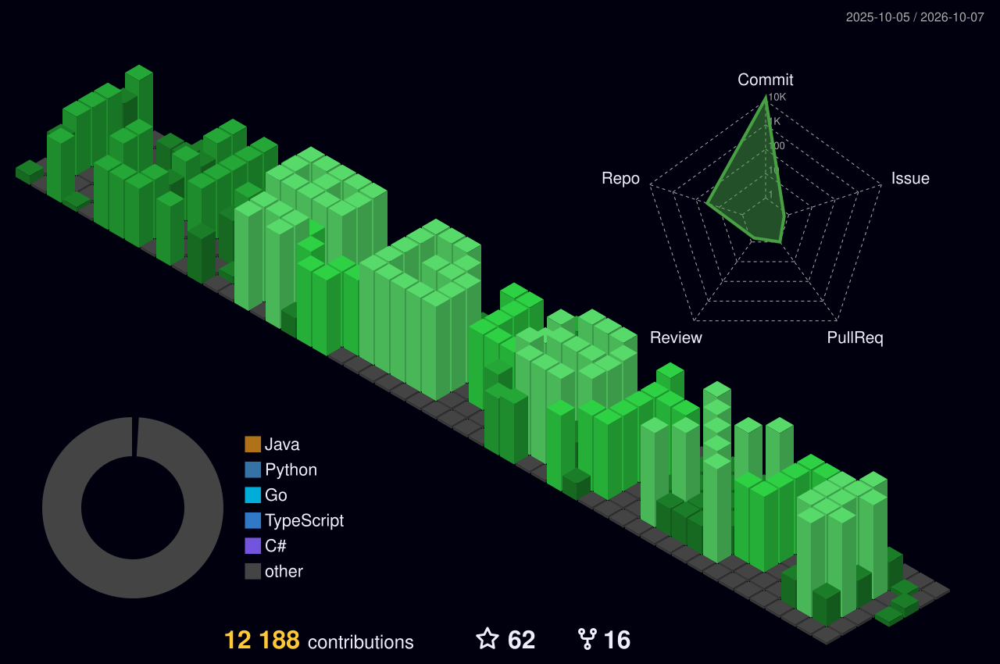

<!--
  NAVEEN KARASU — cyber system UI profile README
  GitHub READMEs do not support arbitrary page CSS/JavaScript, so the dashboard look
  is built from repository-local PNG/SVG assets + HTML tables.
-->

  

<table width="100%">
<tr>
<td width="26%" valign="top">
  
</td>
<td width="48%" valign="top">
  
</td>
<td width="26%" valign="top">
  
</td>
</tr>
</table>

  

<table width="100%">
<tr>
<td width="33.33%" valign="top">
  
</td>
<td width="33.33%" valign="top">
  
</td>
<td width="33.33%" valign="top">
  
</td>
</tr>
</table>

  

<table width="100%">
<tr>
<td width="91%" valign="middle">
  
</td>
<td width="9%" valign="middle">
  
</td>
</tr>
</table>

  

<table width="100%">
<tr>
<td width="50%" valign="top">
  
</td>
<td width="50%" valign="top">
  
</td>
</tr>
</table>

  

  <a href="/naveenkarasu?tab=repositories">Repositories</a>
  ·
  <a href="/naveenkarasu/AI-log-investigator">AI Log Investigator</a>
  ·
  <a href="/naveenkarasu/CEHV12_StudyGuide">CEHv12 Study Guide</a>

