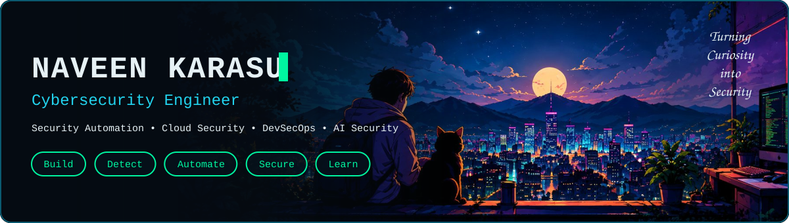
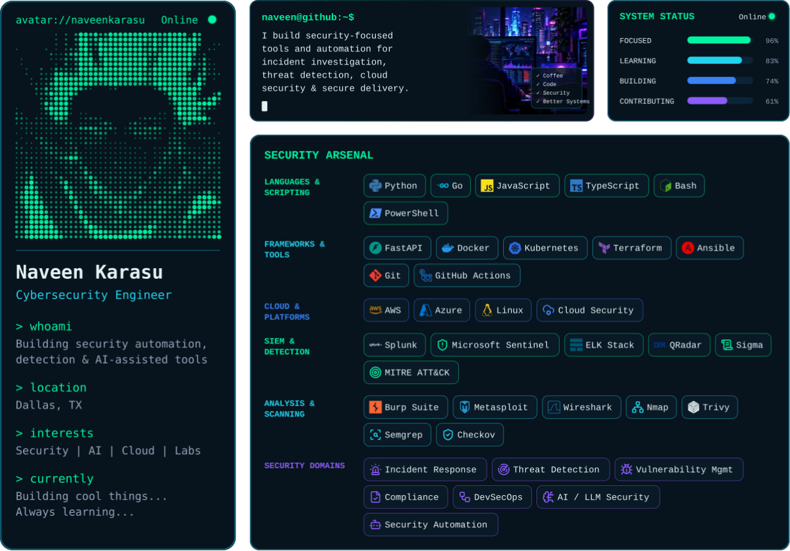
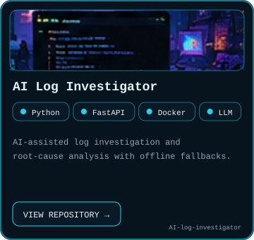
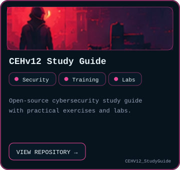
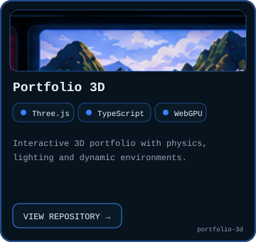
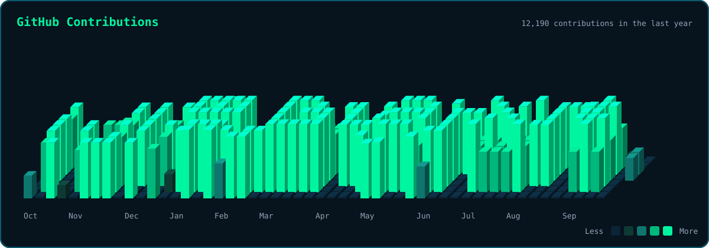
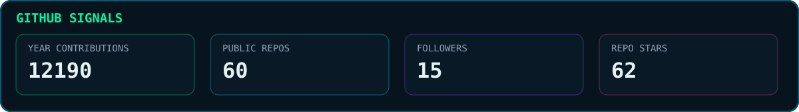
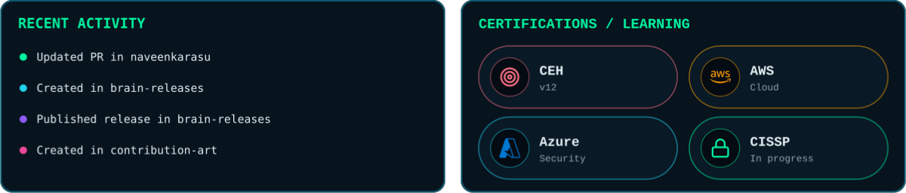
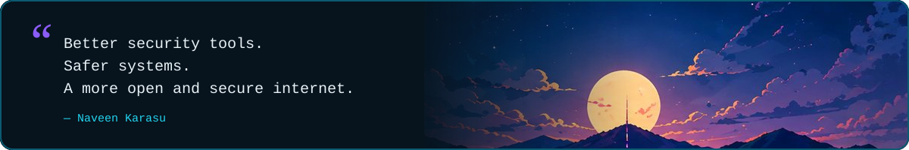
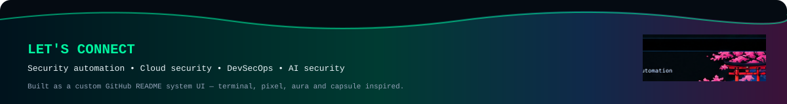

<!--
  NAVEEN KARASU — cyber system UI profile README
  Visual language: anime night-city + terminal + pixel + capsule/aura + night-green contributions.
  GitHub does not allow CSS/JavaScript and always draws table borders, so the layout is built from
  repository-local SVGs: full-width images, composed rows (scripts/compose.py), and inline images
  with no whitespace between them. Links must be absolute: GitHub rewrites relative links.
-->

  

<picture><source media="(prefers-color-scheme: dark)" srcset="./assets/hero.svg" /><source media="(prefers-color-scheme: light)" srcset="./assets/hero-light.svg" /></picture>

<a href="https://github.com/naveenkarasu/AI-log-investigator"><picture><source media="(prefers-color-scheme: dark)" srcset="./assets/projects/ai-log-investigator.svg" /><source media="(prefers-color-scheme: light)" srcset="./assets/projects/ai-log-investigator-light.svg" /></picture></a><a href="https://github.com/naveenkarasu/CEHV12_StudyGuide"><picture><source media="(prefers-color-scheme: dark)" srcset="./assets/projects/cehv12-study-guide.svg" /><source media="(prefers-color-scheme: light)" srcset="./assets/projects/cehv12-study-guide-light.svg" /></picture></a><a href="https://github.com/naveenkarasu/portfolio-3d"><picture><source media="(prefers-color-scheme: dark)" srcset="./assets/projects/portfolio-3d.svg" /><source media="(prefers-color-scheme: light)" srcset="./assets/projects/portfolio-3d-light.svg" /></picture></a>

<picture><source media="(prefers-color-scheme: dark)" srcset="./assets/contributions.svg" /><source media="(prefers-color-scheme: light)" srcset="./assets/contributions-light.svg" /></picture>

<picture><source media="(prefers-color-scheme: dark)" srcset="./assets/contribution-snake-dark.svg" /><source media="(prefers-color-scheme: light)" srcset="./assets/contribution-snake-light.svg" /></picture><picture><source media="(prefers-color-scheme: dark)" srcset="./assets/pixel-cat.svg" /><source media="(prefers-color-scheme: light)" srcset="./assets/pixel-cat-light.svg" /></picture>

<picture><source media="(prefers-color-scheme: dark)" srcset="./assets/stats.svg" /><source media="(prefers-color-scheme: light)" srcset="./assets/stats-light.svg" /></picture>

<picture><source media="(prefers-color-scheme: dark)" srcset="./assets/activity-row.svg" /><source media="(prefers-color-scheme: light)" srcset="./assets/activity-row-light.svg" /></picture>

<picture><source media="(prefers-color-scheme: dark)" srcset="./assets/quote.svg" /><source media="(prefers-color-scheme: light)" srcset="./assets/quote-light.svg" /></picture>

<picture><source media="(prefers-color-scheme: dark)" srcset="./assets/footer.svg" /><source media="(prefers-color-scheme: light)" srcset="./assets/footer-light.svg" /></picture>

  <a href="https://www.linkedin.com/in/naveenkarasu"><picture><source media="(prefers-color-scheme: dark)" srcset="./assets/social/linkedin.svg" /><source media="(prefers-color-scheme: light)" srcset="./assets/social/linkedin-light.svg" /></picture></a>
  <a href="https://github.com/naveenkarasu"><picture><source media="(prefers-color-scheme: dark)" srcset="./assets/social/github.svg" /><source media="(prefers-color-scheme: light)" srcset="./assets/social/github-light.svg" /></picture></a>
  <a href="https://www.x.com/think_kun"><picture><source media="(prefers-color-scheme: dark)" srcset="./assets/social/x.svg" /><source media="(prefers-color-scheme: light)" srcset="./assets/social/x-light.svg" /></picture></a>
  <a href="https://thinkkun.medium.com/"><picture><source media="(prefers-color-scheme: dark)" srcset="./assets/social/medium.svg" /><source media="(prefers-color-scheme: light)" srcset="./assets/social/medium-light.svg" /></picture></a>
  <a href="https://www.dev.to/thinkkun"><picture><source media="(prefers-color-scheme: dark)" srcset="./assets/social/devdotto.svg" /><source media="(prefers-color-scheme: light)" srcset="./assets/social/devdotto-light.svg" /></picture></a>
  <a href="https://thinkkun.hashnode.dev"><picture><source media="(prefers-color-scheme: dark)" srcset="./assets/social/hashnode.svg" /><source media="(prefers-color-scheme: light)" srcset="./assets/social/hashnode-light.svg" /></picture></a>
  <a href="https://stackoverflow.com/users/13547341/thinkkun"><picture><source media="(prefers-color-scheme: dark)" srcset="./assets/social/stackoverflow.svg" /><source media="(prefers-color-scheme: light)" srcset="./assets/social/stackoverflow-light.svg" /></picture></a>
  <a href="https://www.instagram.com/thinkkun"><picture><source media="(prefers-color-scheme: dark)" srcset="./assets/social/instagram.svg" /><source media="(prefers-color-scheme: light)" srcset="./assets/social/instagram-light.svg" /></picture></a>

  <a href="https://github.com/naveenkarasu?tab=repositories">Repositories</a>
  ·
  <a href="https://github.com/naveenkarasu/AI-log-investigator">AI Log Investigator</a>
  ·
  <a href="https://github.com/naveenkarasu/CEHV12_StudyGuide">CEHv12 Study Guide</a>

